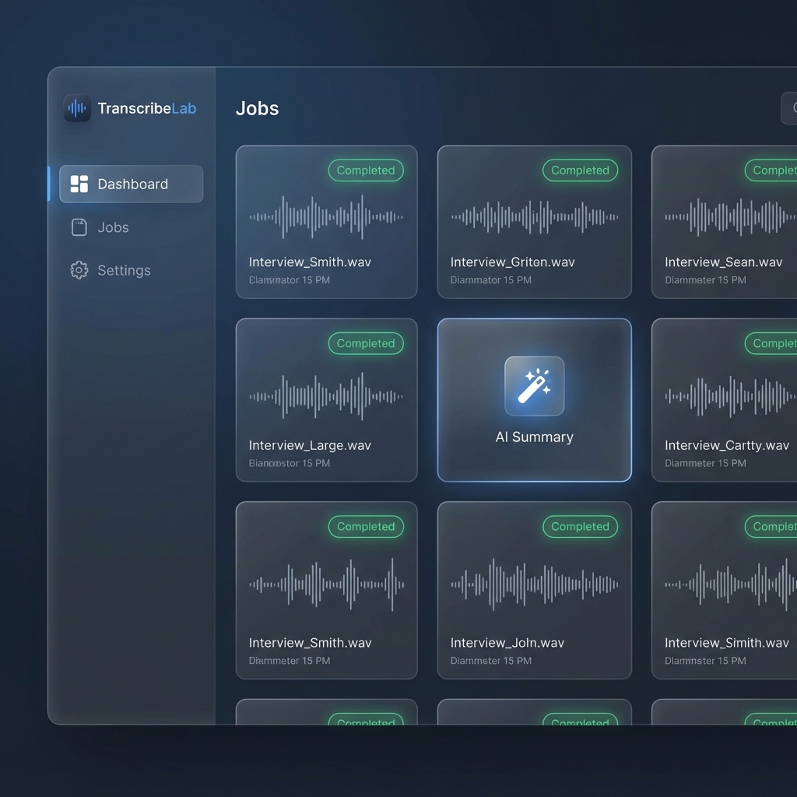

# TranscribeLab

**TranscribeLab** is a secure, self-hosted, AI-powered platform for meeting transcription and summarization. It combines local privacy with state-of-the-art AI to transform audio into structured, actionable insights.



## 🚀 Key Features

### 🔒 Security First
- **Zero-Knowledge Architecture**: All user files are encrypted at rest using **AES-GCM**.
- **Client-Side Key Derivation**: Encryption keys are derived from your password using **PBKDF2**. If you lose your password, the data is unrecoverable.
- **Privacy**: No audio or transcripts are sent to external clouds. Everything runs locally or on your self-hosted docker containers.

### 🧠 Advanced AI
- **Precision Transcription**: Powered by **WhisperX** for speaker-diarized text (distinguishes who said what).
- **Intelligent Summarization**: Uses **Ollama (Qwen2.5)** to generate summaries.
- **"Anti-AI" Style Guide**: Wraps LLM prompts with strict style enforcement (based on Wikipedia guidelines) to produce neutral, fact-based summaries without "marketing fluff" (e.g., bans words like "delve", "tapestry").

### ⚡ Productivity Tools
- **Multi-language Support**: Full support for **English** and **Spanish** (auto-detects and formats output accordingly).
- **Context-Aware Templates**:
  - **Standups**: Focuses on blockers and updates.
  - **Interviews**: Highlights Q&A and candidate profile.
  - **Client Calls**: Extracts requirements and next steps.
- **Outlook Integration**: Drag & drop `.ics` invites to auto-fill meeting details.

---

## 🛠️ Tech Stack

- **Frontend**: [Next.js 14](https://nextjs.org/) (React), CSS Modules (Dark Mode + Glassmorphism).
- **Backend**: [FastAPI](https://fastapi.tiangolo.com/) (Python), Motor (Async MongoDB).
- **Database**: [MongoDB](https://www.mongodb.com/).
- **AI Services**:
  - [WhisperX](https://github.com/m-bain/whisperX) (Dockerized).
  - [Ollama](https://ollama.com/) (Local Instance).

---

## 📦 Prerequisites

1.  **Docker & Docker Compose**: For running the backend services.
2.  **Ollama**: Installed locally on the host machine.
    - Pull the model: `ollama pull qwen2.5:32b` (or your preferred model).
3.  **Hardware**:
    - **RAM**: Minimum 16GB recommended.
    - **GPU**: NVIDIA GPU (CUDA) *OR* decent CPU (AMD Ryzen AI / Intel Core) for inference.
    - *Note: Current configuration is optimized for AMD Ryzen AI (CPU Mode).*

---

## 🏁 Getting Started

### 1. Clone & Configure
```bash
git clone https://github.com/charliepucelano/transcribelab.git
cd transcribelab
```

Create a `.env` file in the root directory (copy from `.env.example`):
```ini
DOMAIN_NAME=localhost
JWT_SECRET=your_super_secret_key_change_this
HF_TOKEN=your_hugging_face_token_for_whisperx
OLLAMA_URL=http://host.docker.internal:11434
```

### 2. Start Services
```bash
docker-compose up -d --build
```
*This starts MongoDB, WhisperX, and the FastAPI Backend.*

### 3. Start Frontend
```bash
cd frontend
npm install
npm run dev
# Runs on port 3002
```

### 4. Access
Open your browser to [http://localhost:3002](http://localhost:3002).

---

## 📖 Usage Guide

1.  **Register**: Create an account. This generates your master encryption key.
2.  **Upload**: Drag an audio file (MP3, WAV, M4A) onto the upload zone.
    - *Optional*: Drag an Outlook `.ics` file to auto-fill metadata.
    - *Optional*: Select a Meeting Type (Webinar, Interview, Standup).
3.  **Process**: The system will transcribe the audio in the background.
4.  **Edit & Summarize**:
    - Open the job to see the transcript.
    - Click the **Wand Icon** 🪄 to generate an AI summary.
    - Switch languages if needed (EN/ES supported).

---

## 🔧 Configuration

### Changing the AI Model
Edit `backend/app/services/summarization.py`:
```python
async def generate_summary(..., model: str = "qwen2.5:32b") -> str:
```

### Hardware Acceleration (GPU)
If you have an NVIDIA GPU, verify `docker-compose.yml` uses the CUDA image:
```yaml
whisperx:
  image: fedirz/faster-whisper-server:latest-cuda
  deploy:
    resources:
      reservations:
        devices:
          - driver: nvidia
            capabilities: [gpu]
```

---

## 📄 License
MIT License.
